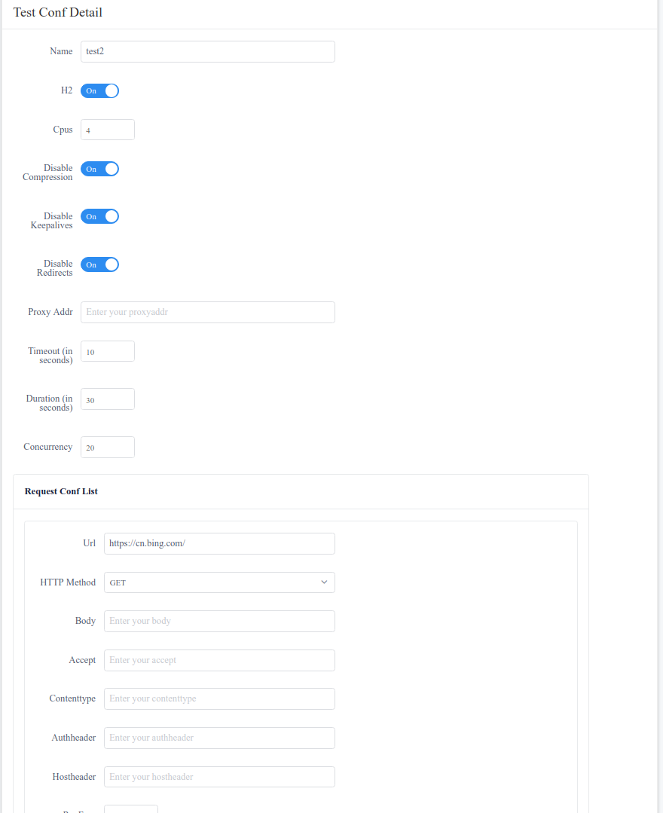

# gostresser

* Go version of simpler, config based locust <a href="https://locust.io">locust.io</a>

## Internal

* It builds a web service based on [gin](https://github.com/gin-gonic/gin), store stress test data in mongo. When you start a stress test, it create some modified [hey](https://github.com/rakyll/hey) workers, and the workers swarm requests to the targets urls. The hey workers transport request stat result to stress server through Grpc, periodically.

## Usage

* a. docker-compose up
  * open [http://localhost:8082/testconf](http://localhost:8082/testconf).

* b. 
  * make build_go (better behind a proxy if in china)
  * make serve_api
  * make serve_ui (in another terminal)
  * open [http://localhost:8082/testconf](http://localhost:8082/testconf).

## Screenshots

* Stress Test Config List

* Edit Stress Config

* Start Stress Test

## Credit:

* <a href="https://github.com/rakyll/hey">hey</a>: HTTP load generator, ApacheBench (ab) replacement, formerly known as rakyll/boom
